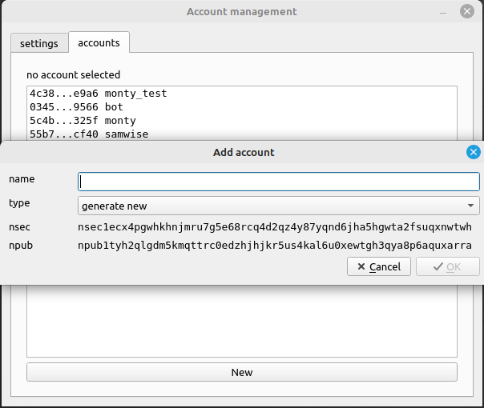
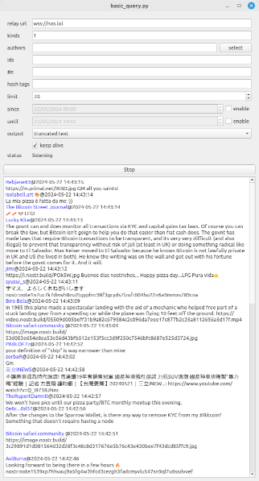

# newty
messing around with python, nostr and qt

# install
```sh
git clone https://github.com/monty888/newty.git
cd newty
python3 -m venv venv
source venv/bin/activate
pip install .
```

# account
Make basic query request to nostr relays.  

 
```shell
TODO...
```

# basic query
Make basic query request to nostr relays.  

 
```shell
python basic_query.py
```

